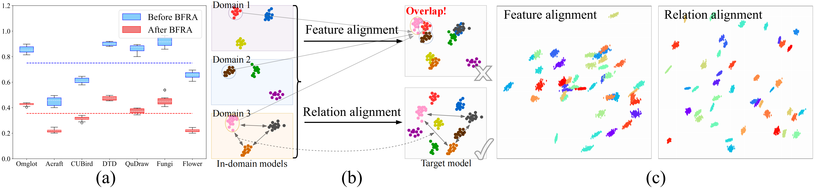
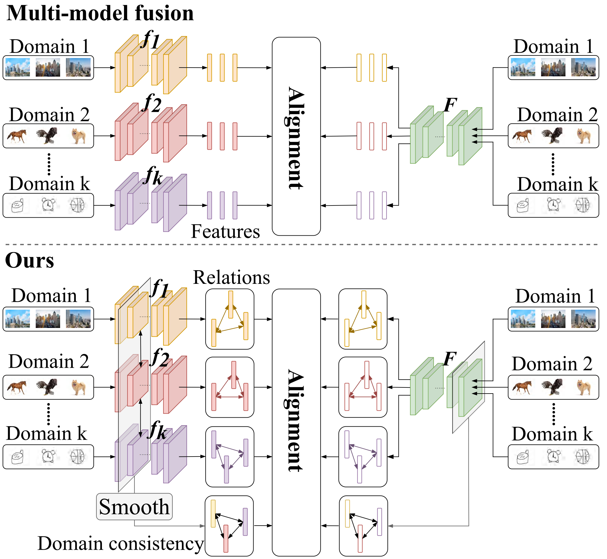
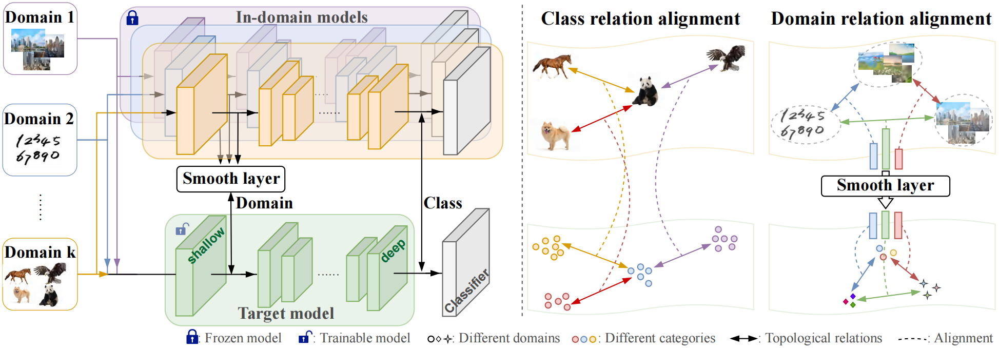

# BFRA: A Bi-level Feature Relation Alignment Method for Cross-Domain Few-Shot Learning
> While existing Few-Shot Learning (FSL) techniques demonstrate strong performance on uniform datasets, they encounter domain shift challenges when presented with domain-agnostic queries in real-world scenarios. So we investigate it in Cross-Domain Few-Shot Learning (CD-FSL) and propose to learn more universal feature representations to enhance generalization on unseen domains. Toward this issue, we pinpoint two issues in current multi-model fusion approaches: 1) the entanglement of domain and class information, and 2) feature overlap across distinct domains. To address these challenges, we introduce a Bi-level Feature Relation Alignment method, BFRA, which facilitates the acquisition of more versatile features by decoupling domain-class relationships and aligning feature relations. Through the segregation of domain and class feature learning, we devise a smoothing layer prior for domain feature alignment to mitigate inter-domain discrepancies. This approach enables our model to acquire domain-consistent features, diminishing interference in subsequent class feature alignment procedures. During the class feature alignment, we notice that class feature representations from various in-domain models may intersect, leading to a diminished distinction between classes. To address this, we adopt a topological perspective to train our target model, by aligning feature relations instead of features between our target model and multiple in-domain models.
The integration of these components results in the establishment of a bi-level feature relation alignment framework aimed at acquiring more universal features. Furthermore, we partially fine-tune the plug-in layer-wise affine adapter on domain-agnostic queries to expedite adaptation without impacting the known domains.



## Environments
The basic environment this project relies on:
- Python 3.7
- PyTorch 1.12.0
- CUDA 11.6
- TensorFlow 1.15.0

Detailed package dependencies:
```
conda install --yes --file requirements.txt
```

## Datasets
This project mainly involves the following two benchmarks:
- [Meta-Dataset](https://github.com/google-research/meta-dataset): It contains 13 datasets (3 additional datasets supplemented by [CNAPs](https://github.com/cambridge-mlg/cnaps)), including:
    - 8 seen datasets: ILSVRC, Omniglot, Aircraft, Birds, Textures, QuickDraw, Fungi, VGG Flower;
    - 5 unseen datasets: Traffic signs, MSCOCO, MNIST, CIFAR10, CIFAR100;
  
  The download and conversion of the first 10 datasets can follow the instructions [here](https://github.com/google-research/meta-dataset/blob/main/doc/dataset_conversion.md).  
  The standard download and processing procedures for the last three datasets can be found [here](https://github.com/cambridge-mlg/cnaps).
- [BSCD-FSL](https://github.com/IBM/cdfsl-benchmark) and [FWT](https://github.com/hytseng0509/CrossDomainFewShot): It contains 8 datasets with a higher degree of cross-domain diversity:
    - ChestX-Ray8, ISIC2018, EuroSAT, Plant Disease;
    - CUB, Cars, Places, Plantae
  
  The download and conversion can follow the instructions [here](https://github.com/IBM/cdfsl-benchmark) and [here](https://github.com/wyharveychen/CloserLookFewShot#self-defined-setting).

The entire dataset takes up about 300G.

## (Prepare) Train the In-domain models

<div align=center>

</div>

Train the baseline model corresponding to each dataset on the seen domain to prepare for the subsequent multi-model fusion pipeline:
```
bash pretrain_train.sh
```
And save the trained model in *BFRA/results/meta_train/pretrained_model/standard*  
Or use a pre-trained single-domain model, we reference the model in [Meta-Dataset RN18 pretrained models](https://drive.google.com/file/d/1MvUcvQ8OQtoOk1MIiJmK6_G8p4h8cbY9/view).

## (Pretrain) Train the Multi-domain target model (BFRA)


Train the multi-domain model on 8 seen domains of Meta-Dataset using our BFRA method within the multi-model fusion pipeline:
```
bash universal_train.sh
```
The backbones on the Meta-Dataset are: ResNet18 and ViT-s;  
The backbones on the BSCD-FSL and FWT are: ResNet10, ResNet18 and ViT-s.


## (Finetune) Finetune the Layer-wise Affine Adaptor (LWAT)
After training the multi-domain model, we need to perform rapid fine-tuning on novel classes to adapt to new data.  
This includes two scenarios: 1) Seen Domain Unseen Class and 2) Unseen Domain Unseen Class.  
We use the LWAT method for adaptation and treat all domains equally to simulate real-world application scenarios:
```
bash affine_train.sh
```
Then, the fine-tuned model is tested on datasets from all domains:
```
bash affine_test.sh
```

## Main results

|          | IMANet   | Omglot   | Acraft   | CUBird | DTD | QuDraw | Fungi | Flower | TrSign | MSCOCO | MNIST | CF10 | CF100 | ACG.|
| :---:    | :---:    | :---:    | :---:    | :---: | :---: | :---: | :---: | :---: | :---: | :---: | :---: | :---: | :---: | :---: |
|Ours_RN18 | 54.4±1.2 | 92.4±0.5 | 94.8±0.3 | 85.4±0.5 | 92.1±0.5 | 77.6±0.6 | 61.9±1.0 | 94.7±0.2 | 88.6±0.6 | 55.4±0.9 | 98.8±0.1 | 86.2±0.5 | 70.4±0.9 | 81.0 |
|Ours_ViT_s| 73.6±0.9 | 90.9±0.8 | 90.8±0.5 | 91.2±0.5 | 86.2±0.7 | 79.5±0.8 | 76.4±0.9 | 95.9±0.5 | 89.7±0.8 | 60.6±1.0 | 97.1±0.3 | 91.1±0.6 | 83.7±0.7 | 85.2 |

|          |          |          |          | 5W1S  |       |       |        |       |          |          |          | 5W5S  |       |       |        |       |
| :---:    | :---:    | :---:    | :---:    | :---: | :---: | :---: | :---:  | :---: | :---:    | :---:    | :---:    | :---: | :---: | :---: | :---:  | :---: |
|          | ChestX   | ISIC     | EAST     | Crop  | CUB   | Cars  | Places | Plant | ChestX   | ISIC     | EAST     | Crop  | CUB   | Cars  | Places | Plant |
|Ours_RN10 |23.9      | 44.8     | 74.5     | 89.1  | 60.8  | 47.8  | 64.8   | 52.1  | 29.2     | 62.1     | 89.4     | 95.9  | 85.9  | 64.7  | 83.3   | 71.1  |
|Ours_RN18 |24.4      | 46.3     | 75.3     | 89.9  | 62.3  | 48.9  | 66.2   | 53.5  | 30.6     | 62.8     | 90.2     | 96.6  | 87.4  | 66.1  | 84.5   | 72.9  |
|Ours_ViT_s|26.4      | 42.9     | 76.1     | 87.7  | 86.7  | 50.2  | 76.9   | 58.4  | 29.4     | 57.8     | 92.1     | 96.6  | 95.9  | 69.5  | 91.4   | 81.9  |


## Acknowledgements
We appreciate [Meta-Dataset](https://github.com/google-research/meta-dataset), [BSCD-FSL](https://github.com/IBM/cdfsl-benchmark) and [FWT](https://github.com/hytseng0509/CrossDomainFewShot) for their contributions to the dataset construction.  
We thank authors of [URL](https://github.com/VICO-UoE/URL) and [PMF](https://github.com/hushell/pmf_cvpr22) for their source code.


